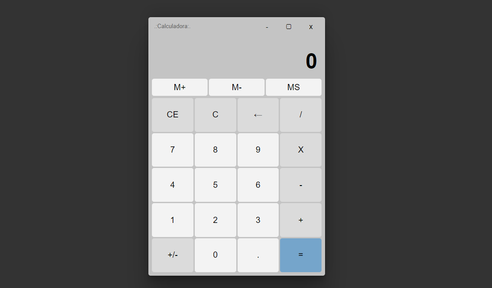

# CalculadoraJs

This project was developed using HTML5, CSS3 and JavaScript, we used manipulation and access of elements in the DOM, logic based on values extracted from the user, manipulation of the position of elements with flex box and grid layout, among others.

Made together with the Institution Hora de Codar with professor Matheus Battisti

## Thanks for visiting my project! 😉
You can check out other projects I've developed here on my GitHub, or contact me through the other links.

 
